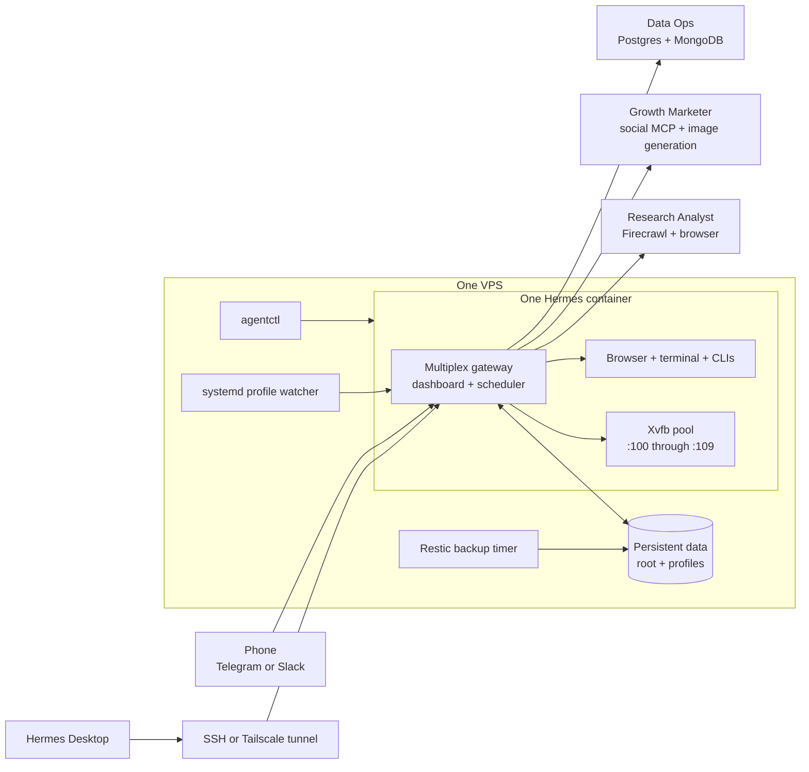

# hermes-agent-fleet

Run a roster of persistent AI employees on one inexpensive VPS using native
[Hermes Agent](https://github.com/NousResearch/hermes-agent) profiles. Each
employee has a personality, model, tools, MCP connections, routines, memory,
sessions, home directory, workspace, browser, and virtual desktop. The gateway
runs continuously even when your laptop is closed.

This project does not fork Hermes. It adds a thin derived image with practical
CLIs, a profile-aware Xvfb display pool, example employee seeds, host-side
systemd units, encrypted backups, a temporary shared file drop, and one Bash
entrypoint: `agentctl`.

Public repository: [hermes-agent-fleet](https://github.com/JuezRafecas/hermes-agent-fleet)

## Architecture



One gateway multiplexes every directory under `data/profiles/`. Root files in
`data/` cascade to profiles; profile files remain scoped to that profile. The
profile set is live filesystem state, so employees can be added without
building or redeploying the image.

The isolation is logical, not adversarial. Profiles share a container, Unix
user, kernel, process environment inherited at startup, and installed binaries.
Use this topology for employees owned by the same trusted operator. If profiles
belong to mutually untrusted customers, need hostile-code execution, or require
hard tenant isolation, give them separate OS sandboxes or separate hosts.

## What is included

- Pinned official `nousresearch/hermes-agent` image with no source patches.
- `agentctl` for install, lifecycle, profiles, models, secrets, skills,
  displays, local archives, Restic/S3 backups, and migration helpers.
- `psql`, `mongosh`, `gh`, `jq`, `rg`, `pnpm`, `agent-browser`, and MCP wrapper
  dependencies inside the image.
- Ten supervised Xvfb displays with deterministic profile assignments.
- Host-side profile watcher and daily backup timer.
- Example employees under `agents/`.
- Shared skills plus `skills-sync`.
- S3-compatible temporary file publishing with a 30-day lifecycle contract.
- A generic macOS LaunchAgent for a persistent loopback-only SSH tunnel.

## Prerequisites

You need:

- A Linux VPS with Docker Engine and the Docker Compose plugin.
- Enough resources for your models and browser workload. A small deployment can
  start around 4 vCPU, 8 GB RAM, and 40 GB disk; concurrent Chromium sessions,
  large repositories, and local model services need more.
- A DNS name only if you deliberately add a reverse proxy. The default design
  requires no public dashboard port.
- A non-root operator account with controlled sudo for `/srv/hermes/agentctl`.
- Model access through Codex, Claude, OpenRouter, or another Hermes-supported
  provider.
- Optional Tailscale for private VPS access.
- Optional Hermes Desktop for the full chat, sessions, profiles, groups, and
  routine UI.
- Optional Telegram or Slack credentials for phone-friendly chat delivery.
- `restic` on the host if you want encrypted off-site backups.

Do not place secrets in the repository, Compose file, seed YAML, command
arguments, screenshots, or chat. `agentctl set-secret` reads values from stdin.

## Install on a VPS

### 1. Clone and prepare the operator

```bash
git clone https://github.com/your-account/hermes-agent-fleet.git
cd hermes-agent-fleet

# Run once as root, then start a new login session for group membership.
sudo usermod -aG docker "$USER"
```

If you want passwordless operation, allow only the reviewed entrypoint rather
than broad sudo. Review this against your own security policy:

```text
operator ALL=(root) NOPASSWD: /srv/hermes/agentctl *
```

### 2. Install

```bash
sudo HERMES_ROOT=/srv/hermes ./agentctl install
```

`install` copies the source layer into `/srv/hermes`, creates persistent
`data/` and `backups/`, generates a random dashboard password and stable
session-signing secret when `data/.env` is absent, builds the derived image,
installs the systemd units, and starts the container. It is idempotent for
source updates and preserves existing profile data.

The dashboard is published only at VPS loopback:

```text
127.0.0.1:9119
```

Read the generated credentials directly on the VPS. Do not paste them into a
shell history or chat transcript:

```bash
sudo sed -n '/^HERMES_DASHBOARD_BASIC_AUTH_/p' /srv/hermes/data/.env
```

### 3. Connect model subscriptions

Codex uses one shared device login that cascades to all profiles:

```bash
sudo /srv/hermes/agentctl login-codex
```

For a Claude subscription, run `claude setup-token` in a trusted local terminal
and send the token to the VPS command through stdin. A safe interactive pattern
is:

```bash
read -rs CLAUDE_TOKEN
printf '%s\n' "$CLAUDE_TOKEN" | sudo /srv/hermes/agentctl set-secret CLAUDE_CODE_OAUTH_TOKEN
unset CLAUDE_TOKEN
```

Load OpenRouter the same way:

```bash
read -rs ROUTER_TOKEN
printf '%s\n' "$ROUTER_TOKEN" | sudo /srv/hermes/agentctl set-secret OPENROUTER_API_KEY
unset ROUTER_TOKEN
```

These are shared root credentials. Put a credential in a profile `.env` when
only that employee should receive it.

### 4. Seed employees

```bash
sudo /srv/hermes/agentctl add research-analyst --seed agents/research-analyst
sudo /srv/hermes/agentctl add growth-marketer --seed agents/growth-marketer
sudo /srv/hermes/agentctl add data-ops --seed agents/data-ops
```

Each seed contains only identity, model selection, environment variable names,
and MCP configuration. Load the actual values afterward:

```bash
read -rs FIRECRAWL_TOKEN
printf '%s\n' "$FIRECRAWL_TOKEN" | sudo /srv/hermes/agentctl set-secret FIRECRAWL_API_KEY --profile research-analyst
unset FIRECRAWL_TOKEN
```

Repeat for the endpoint and keys listed in that seed's
`profile.env.example`. Start a new profile session after changing MCP
configuration or credentials.

### 5. Open the dashboard or Hermes Desktop

With an SSH alias named `hermes-vps` on macOS:

```bash
mac/install-tunnel.sh hermes-vps
```

Add `http://127.0.0.1:19119` as a Hermes Desktop connection and sign in with
the generated dashboard credentials. Tailscale is optional but recommended as
the private path underneath SSH. Do not expose port `9119` directly to the
public Internet.

### 6. Add Telegram or Slack

Use the dashboard's platform/channel settings for the Hermes version pinned by
this repository, or edit the matching upstream configuration under
`/srv/hermes/data/config.yaml`. Load the bot token or app credential through
`agentctl set-secret`, restart the gateway, and verify with a harmless message
from the intended private chat or workspace.

Channel schemas can change upstream, so consult the documentation for the
pinned Hermes release before adding fields. A connected channel proves
transport health; it does not authorize an employee to message customers or
publish business content.

## Day-to-day profile management

List employees and their serving state:

```bash
sudo /srv/hermes/agentctl ls
```

Create a blank employee, choose a model, or start from a seed:

```bash
sudo /srv/hermes/agentctl add finance-reviewer --desc "Reviews weekly finance exports"
sudo /srv/hermes/agentctl model finance-reviewer openai-codex/gpt-5.6-sol
sudo /srv/hermes/agentctl add another-researcher --seed agents/research-analyst
```

`agentctl add` uses Hermes native profile creation, assigns a free virtual
display, writes seed configuration, and reloads the gateway. It does not build
or redeploy the container.

Removal is intentionally destructive to live profile state, although it first
creates a timestamped tar archive:

```bash
sudo /srv/hermes/agentctl rm finance-reviewer
```

Prefer pausing routines and removing capabilities before deleting an employee.
Preserve any required sessions, memory, outputs, and history first.

The gateway resolves the profile set only when it starts. If a profile created
through Hermes Desktop or chat does not appear, run:

```bash
sudo /srv/hermes/agentctl reload
```

The systemd path watcher normally closes this gap automatically after the
profile writer has settled.

## One model per employee

The profile config uses a mapping, not a single string:

```yaml
model:
  provider: openai-codex
  default: gpt-5.6-sol
```

Examples:

```bash
agentctl model research-analyst anthropic/claude-opus-5
agentctl model data-ops openai-codex/gpt-5.6-sol
agentctl model growth-marketer openrouter/anthropic/claude-opus-5
```

One root Codex login or root provider token can serve the fleet, while the
model choice remains per profile. You can instead store provider credentials
inside one profile to limit who inherits them. Confirm that your subscription
terms permit the intended server and automation use.

## YOLO mode

The Compose configuration sets `HERMES_YOLO_MODE=1`, and the shared config uses
`approvals.mode: "off"`. This makes unattended routines practical, but it is a
major trust decision:

- Normal confirmation prompts are bypassed.
- Every enabled tool and inherited credential is available to the model within
  its profile context.
- Profiles share one container, so profile boundaries are not OS security
  boundaries.
- Hermes hard blocks may still reject some lifecycle or destructive commands.
- A routine that can send, spend, publish, delete, or mutate external state is
  durable authority for its exact instruction.

Use restricted provider credentials, read-only database users, explicit
SOUL boundaries, bounded routines, external backups, and provider-side limits.
Turn YOLO off if your threat model requires per-action confirmation.

## MCPs: HTTP templates versus stdio wrappers

For an HTTP MCP, Hermes expands `${VAR}` in URL/header configuration from the
active profile environment. The research seed uses this pattern:

```yaml
mcp_servers:
  firecrawl:
    url: "${FIRECRAWL_MCP_URL}"
    headers:
      Authorization: "Bearer ${FIRECRAWL_API_KEY}"
```

Stdio MCP commands are different. In the current runtime path, `${VAR}` inside
stdio `args` or `env` may be passed literally instead of expanded with the
active profile's `.env`. A process-global value is also unsafe when two
profiles require different credentials.

Use a profile-aware wrapper. The wrapper receives a non-secret profile name,
reads only `/opt/data/profiles/<profile>/.env`, exports the provider variable,
and then `exec`s the MCP. The Data Ops seed demonstrates both included wrappers:

```yaml
mcp_servers:
  postgres:
    command: neon-mcp
    args: ["data-ops"]
  mongo:
    command: mongo-mcp
    args: ["data-ops", "--read-only"]
```

Create another wrapper under `config/bin/` when adding a profile-scoped stdio
integration. Never put a secret in `agent.yaml`, wrapper arguments, or command
output.

## Shared skills and GitHub authentication

Put reusable, tenant-neutral skills under `config/skills-shared/<skill>/` and
publish them to the default profile plus every employee:

```bash
sudo /srv/hermes/agentctl skills-sync
```

The command replaces each shared skill directory as a unit, avoiding partial
merges and broken symlinks.

Agent terminals are launched with a scrubbed environment and a profile-specific
home. A root `GH_TOKEN` environment variable therefore does not make `gh` work
inside every employee terminal. Authenticate once into file-backed `hosts.yml`
and synchronize it:

```bash
read -rs GITHUB_TOKEN
printf '%s\n' "$GITHUB_TOKEN" | sudo /srv/hermes/agentctl set-secret GH_TOKEN
unset GITHUB_TOKEN
sudo /srv/hermes/agentctl gh-sync
```

`gh-sync` copies the authenticated file into each profile home with mode
`0600`. Re-run it after adding a profile or rotating GitHub authentication.

## Routines and cron

Hermes owns routines per profile:

```bash
docker exec hermes /opt/hermes/bin/hermes -p research-analyst \
  cron create "0 8 * * 1-5" "Review the morning research queue" --name morning-review
docker exec hermes /opt/hermes/bin/hermes -p research-analyst cron list
```

Routines persist below `data/profiles/<name>/cron/`, and one multiplex
scheduler ticks all profiles. With `approvals.cron_mode: approve`, a run does
not pause for an interactive prompt. Write narrow instructions, idempotency
rules, provider limits, and a clear delivery target. Pause a routine to revoke
future recurring authority; do not use deletion as pause if history matters.

For deterministic work, put a script in the profile workspace or scripts
directory and let the model interpret bounded output. Do not ask an LLM to
reimplement a query, reconciliation, or file transformation on every run.

## Computer use and the Xvfb display pool

The image supervises ten virtual X displays, `:100` through `:109`. `default`
always owns `:100`; each added employee gets the lowest free display. The
durable map is `data/.displays.json`.

```bash
sudo /srv/hermes/agentctl displays
```

The `cua-driver` wrapper resolves the current session profile and exports only
that employee's display to the child process. `BASH_ENV` makes the terminal see
the same value. This prevents two employees from sharing windows by accident,
but it is not OS isolation. The pool supports nine named employees plus
`default`; the next add fails before profile creation.

The headless browser does not need Xvfb and should be preferred for normal web
automation. Computer use on Linux remains an upstream alpha-quality surface;
test benign window listing and screenshots after upgrades.

## Encrypted backups to any S3-compatible provider

Use a private bucket and credentials separate from the public file drop. Load:

- `BACKUP_S3_ENDPOINT`
- `BACKUP_S3_BUCKET`
- `BACKUP_S3_ACCESS_KEY_ID`
- `BACKUP_S3_SECRET_ACCESS_KEY`
- `BACKUP_S3_REGION`
- `RESTIC_PASSWORD` of at least 32 characters

Then run:

```bash
sudo /srv/hermes/agentctl backup-s3
sudo /srv/hermes/agentctl snapshots-s3
sudo /srv/hermes/agentctl restore-s3 latest /srv/hermes/restore-drill-001
```

Restic encrypts before upload. The timer runs a local tar backup and then an
off-site S3 backup, retaining 14 daily and 8 weekly snapshots with pruning.
`restore-s3` requires a new absolute destination and never overwrites active
`data/`. Inspect and verify a drill before planning a controlled cutover. A
successful backup command is not restore proof; keep the Restic password in a
separate password manager.

## Shared file drop with 30-day expiry

The `shared-file-drop` skill publishes temporary artifacts to any public
S3-compatible bucket:

```bash
shared-file-upload report.html
shared-file-upload ./site --dir quarterly-review
```

Load `SHARE_PUBLIC_URL`, `S3_ENDPOINT`, `S3_BUCKET`, `S3_ACCESS_KEY_ID`,
`S3_SECRET_ACCESS_KEY`, and optional `S3_REGION`. Configure the provider to
delete `shared/` objects after 30 days. The uploader adds a retention tag and
HTTP expiry, but only the bucket lifecycle rule guarantees deletion.

The returned URL is a handoff mechanism, not private storage. Never upload
credentials, personal data, private exports, or anything unsuitable for a
link-accessible object. Keep the file-drop bucket and Restic backup bucket
separate.

## Parallel remote coding lane with Orca

Hermes profiles are long-lived employees. Repository engineering benefits from
a separate lane with its own Unix identity, project clones, auth, toolchains,
and disposable worktrees. The same VPS can host both without mixing them.

A practical topology is:

```text
Orca Desktop or phone
        |
        | private Tailscale path
        v
orca serve   (Unix user: orca)
        |
        +-- /srv/orca/projects/<repo>
        +-- /srv/orca/workspaces/<worktree>
        +-- /home/orca/.codex
        `-- user-local toolchains
```

Install Orca headless as its own `orca` Unix user and run `orca serve` through
a dedicated systemd user or system service. Bind it only to a private interface
or loopback tunnel. Pair the desktop environment during an intentional
enrollment window, then close new pairing. Clone approved repositories under
`/srv/orca/projects`, not inside Hermes data.

Install toolchains in the Orca user's home: `fnm` for Node versions, `pnpm` and
`bun` for JavaScript projects, and user-local Go tooling. Give Orca its own
Codex login and file-backed GitHub auth; never copy Hermes profile auth or mount
Hermes state into Orca. Pair a remote environment from the desktop, create a
workspace/worktree for each task, and follow long-running work from the phone
without keeping the laptop awake.

This lane is intentionally parallel. Hermes employees can operate continuously
while Orca handles full repositories and disposable coding workspaces. Sharing
a VPS does not mean sharing Unix users, credentials, homes, container sockets,
or project state.

## Security notes

- The dashboard binds to VPS loopback. Reach it through SSH or Tailscale.
- Use a stable `HERMES_DASHBOARD_BASIC_AUTH_SECRET`; without it, gateway
  restarts invalidate desktop sessions.
- Restrict sudo to the reviewed entrypoint. Avoid exposing Docker control to AI
  employees unless your threat model accepts host-level authority.
- Secrets enter through stdin and live in ignored `.env` files with restrictive
  permissions. Seed files contain names only.
- Use profile-specific credentials and read-only database roles by default.
- Treat group chats as coordination, not authorization or isolation.
- Treat YOLO mode and mutable external MCPs as durable operational power.
- Back up before deletion, test restores, and keep off-site credentials outside
  the VPS.
- Pin the upstream image tag and digest. Review release notes and rerun tests
  before upgrading.
- The derived image is convenient, not hardened for mutually hostile tenants.

## Troubleshooting

| Symptom | Cause | Fix |
|---|---|---|
| A new employee exists on disk but is absent from Desktop | The gateway resolved profiles at startup | Run `agentctl reload`; verify the profile watcher unit |
| Desktop signs out after each restart | Missing or changing dashboard session secret | Keep `HERMES_DASHBOARD_BASIC_AUTH_SECRET` stable in `data/.env` |
| Dashboard returns 401 or fails closed | Missing basic-auth username/password | Restore the generated auth variables and restart |
| `gh` works at root but not in an employee terminal | Terminals use scrubbed env and profile homes | Run `agentctl gh-sync` to install file-backed auth |
| A stdio MCP receives literal `${VAR}` | Stdio args/env interpolation is not profile-aware | Use a wrapper like `neon-mcp` or `mongo-mcp` |
| An HTTP MCP starts but provider calls fail | Transport configuration is not credential proof | Load the profile secret and run a harmless authenticated read |
| Computer use opens another employee's windows | Invalid or stale display mapping | Run `agentctl displays`, inspect `.displays.json`, and restart the Xvfb service |
| An eleventh profile cannot be added | The ten-display pool includes `default` | Expand and test the display pool or remove an unused profile |
| `Xvfb -help | head` fails in a script | `head` closes the pipe and Xvfb receives SIGPIPE under `pipefail` | Redirect help to a file, inspect it afterward, or explicitly tolerate that probe |
| A profile cannot restart the gateway itself | Hermes blocks supervised self-termination | Use the host watcher or `agentctl reload` |
| S3 backup cannot initialize | Endpoint, bucket, credentials, or Restic password is missing | Validate only variable presence and provider access; never print values |

Useful diagnostics:

```bash
sudo /srv/hermes/agentctl status
sudo /srv/hermes/agentctl logs -f
sudo /srv/hermes/agentctl ls
sudo /srv/hermes/agentctl displays
systemctl status hermes-profiles.path hermes-backup.timer
```

## FAQ

### Is this a Hermes fork?

No. The Dockerfile starts from a pinned official image and adds OS packages,
wrappers, a supervised X display pool, and the shared upload CLI. It does not
patch Hermes source.

### Does every employee need a container?

No. Native Hermes profiles share one multiplexed gateway. That is the main
reason this runs on a cheap VPS. Use separate sandboxes when you need a real
security boundary.

### Can I add employees from the UI?

Yes. Hermes Desktop can create profiles, and the host watcher reloads the
gateway when the profile directory set changes. Seeds through `agentctl add`
are more repeatable because identity, environment names, model, and MCPs are
reviewable in Git.

### Can employees use different models while sharing subscriptions?

Yes. Model selection is per profile. Root auth can cascade to all profiles,
while profile `.env` files can hold narrower credentials. Verify the relevant
provider and subscription terms for unattended server use.

### Does a virtual display isolate profiles securely?

It isolates windows and screenshots operationally. It does not isolate
processes, filesystem access, kernel access, or credentials at the OS level.

### Can an employee publish or spend automatically?

Technically, if its MCP and credential allow it. Operationally, connectivity is
not permission. Encode explicit authority, account scope, limits, idempotency,
and reconciliation in the routine and SOUL before enabling external mutations.

### Is the shared file drop private?

No. It is temporary link-accessible storage. Use private repositories or
another protected artifact system for sensitive work.

### Is a successful backup enough?

No. Run periodic restores to a new directory and verify the expected sessions,
memory, profile configuration, routines, and files before you rely on it.

### Why keep Orca separate from Hermes?

They have different state and trust models. Hermes owns persistent employees,
conversation, routines, and business tools. Orca owns project clones,
worktrees, coding auth, and developer toolchains. Separate Unix users make that
boundary visible and maintainable.

## Development and verification

Run the source-only checks without Docker:

```bash
python3 -m unittest discover -s test -p 'test_*.py' -v
find . -type f -perm -u+x -print
bash -n agentctl test/smoke.sh mac/install-tunnel.sh scripts/profiles-reload.sh s6/xvfb/run
```

`test/smoke.sh` is the opt-in end-to-end Docker smoke. It builds an image and
starts a disposable fleet, so run it only on a host where Docker execution is
explicitly authorized.

## License

MIT. See [LICENSE](LICENSE).
